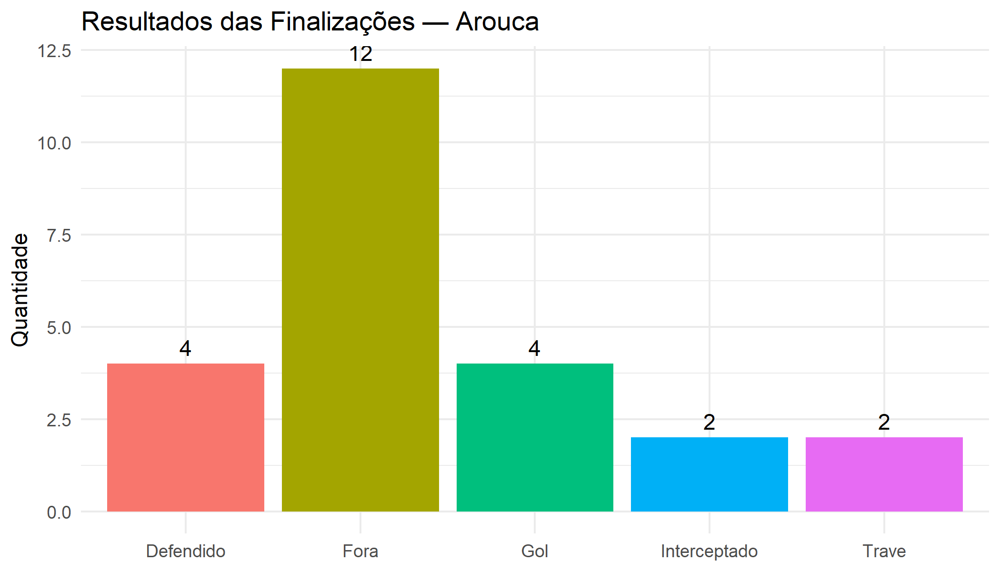
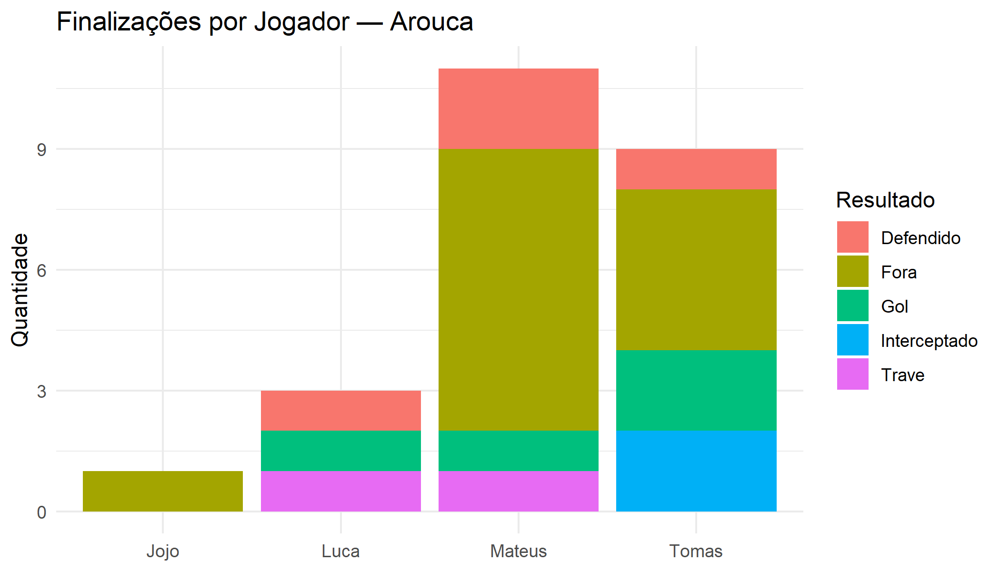
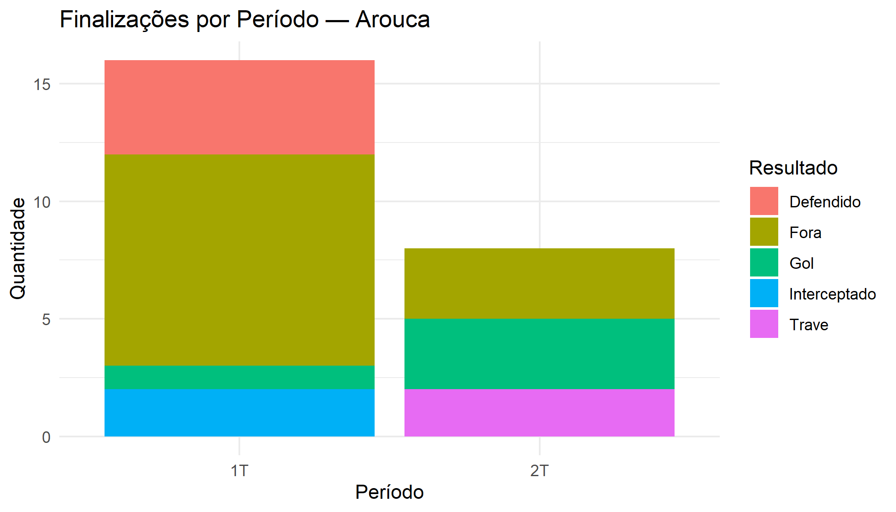
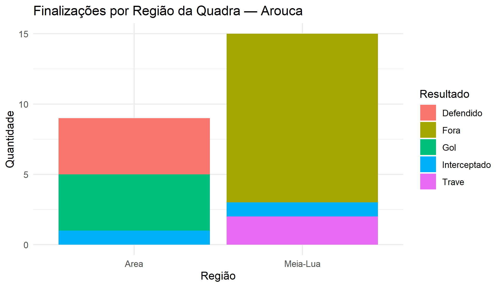

# Relatório de Scouting — Arouca
**Competição:** Futsal Sub-6  
**Jogo:** Arouca × Real Juventus  
**Disciplina:** Projeto de Machine Learning — IBMEC Rio de Janeiro

---

## 1. Escalação

| Nº | Jogador | Posição | Pé Dominante |
|---|---|---|---|
| 1 | Bento | Goleiro | Destro |
| 10 | Matteo Marques | Ala | Canhoto |
| 14 | Thomás | Pivô | Destro |
| 19 | Bernardo | Ala | Destro |
| 23 | Joaquim / Joca | Fixo | Destro |
| 37 | Josué / Jojô | Fixo | Canhoto |
| 39 | Valentim | Jogador de Linha | Destro |
| 61 | Lucca Gabriel | Ala | Destro |

---

## 2. Eventos da Partida

### Finalizações

| Tempo | Jogador | Resultado | Pé | Região | Baliza | Período |
|---|---|---|---|---|---|---|
| 28:33 | Matteo | Fora | Canhoto | Meia-Lua | — | 1T |
| 29:06 | Thomás | Defendido | Destro | Área | — | 1T |
| 29:47 | Thomás | Fora | Destro | Meia-Lua | — | 1T |
| 30:51 | Matteo | Fora | Canhoto | Meia-Lua | — | 1T |
| 33:46 | Jojô | Fora | Canhoto | Meia-Lua | — | 1T |
| 36:08 | Matteo | Fora | Canhoto | Meia-Lua | — | 1T |
| 37:56 | Thomás | Fora | Destro | Meia-Lua | — | 1T |
| 39:04 | Matteo | Defendido | Canhoto | Área | — | 1T |
| 39:14 | Lucca | Defendido | Destro | Área | — | 1T |
| 39:58 | Thomás | Interceptado | Destro | Meia-Lua | — | 1T |
| 40:27 | Thomás | Fora | Destro | Meia-Lua | — | 1T |
| 43:07 | Thomás | Fora | Destro | Meia-Lua | — | 1T |
| 44:12 | Matteo | Defendido | Canhoto | Área | — | 1T |
| 45:56 | Matteo | Fora | Canhoto | Meia-Lua | — | 1T |
| 46:44 | Thomás | Interceptado | Destro | Área | — | 1T |
| 47:42 | Thomás | **Gol** | Destro | Área | Baixo Esquerdo | 1T |
| 1:01:14 | Matteo | Trave | Canhoto | Meia-Lua | — | 2T |
| 1:02:18 | Matteo | Fora | Canhoto | Meia-Lua | — | 2T |
| 1:06:24 | Matteo | **Gol** | Canhoto | Área | Baixo Esquerdo | 2T |
| 1:08:31 | Lucca | Trave | Destro | Meia-Lua | — | 2T |
| 1:13:41 | Matteo | Fora | Canhoto | Meia-Lua | — | 2T |
| 1:14:02 | Lucca | **Gol** | Destro | Área | Alto Direito | 2T |
| 1:16:35 | Matteo | Fora | Canhoto | Meia-Lua | — | 2T |
| 1:17:19 | Thomás | **Gol** | Destro | Área | Centro | 2T |

### Escanteios

| Nº | Tempo | Cobrador | Lado |
|---|---|---|---|
| 1 | 28:48 | Matteo | Esquerdo |
| 2 | 37:04 | Matteo | Direito |
| 3 | 40:08 | Matteo | Esquerdo |

### Faltas

| Tempo | Responsável | Equipe | Jogador Infringido | Local |
|---|---|---|---|---|
| 57:55 | Jojô | Arouca | — | Área de defesa |
| 1:04:48 | Bernardo Silva | Real Juventus | Thomás | Meio |
| 1:15:40 | Vicente | Real Juventus | Matteo | Campo de ataque |
| 1:15:40 | Bernardinho | Real Juventus | Thomás | Campo de ataque |

### Cartões

Nenhum cartão registrado na partida.

---

## 3. Análise Exploratória (EDA)

### Visão Geral

| Métrica | Valor |
|---|---|
| Total de finalizações | 24 |
| Gols | 4 |
| Taxa de conversão | 16,7% |
| Finalizações no 1º tempo | 16 |
| Finalizações no 2º tempo | 8 |
| Escanteios a favor | 3 |
| Faltas cometidas | 1 |
| Faltas sofridas | 3 |

### Desempenho por Jogador

| Jogador | Finalizações | Gols | Aproveitamento |
|---|---|---|---|
| Matteo | 11 | 1 | 9,1% |
| Thomás | 9 | 2 | 22,2% |
| Lucca | 3 | 1 | 33,3% |
| Jojô | 1 | 0 | 0,0% |

### Finalizações por Região da Quadra

| Região | Finalizações | Gols |
|---|---|---|
| Meia-Lua | 15 | 0 |
| Área | 9 | 4 |

### Finalizações por Pé

| Pé | Finalizações |
|---|---|
| Canhoto | 12 |
| Destro | 12 |

**Observações:**
- O 2º tempo foi mais eficiente: 3 dos 4 gols com apenas 8 finalizações
- Todos os gols saíram de dentro da área — nenhuma finalização da meia-lua converteu
- Luca teve o melhor aproveitamento (33,3%) com menos tentativas
- Mateus foi o mais ativo mas com menor eficiência entre os que marcaram

---

## 4. Gráficos

---

## 5. Machine Learning

### Objetivo
Prever se uma finalização resulta em gol com base em três variáveis: jogador, período e região da quadra.

### Modelo: Random Forest
100 árvores de decisão treinadas sobre as 24 finalizações registradas.

### Resultados

| Métrica | Valor |
|---|---|
| Taxa de erro (OOB) | 12,5% |
| Não-gols acertados | 20 de 20 |
| Gols acertados | 1 de 4 |

### Importância das Variáveis

| Variável | Importância |
|---|---|
| Região da quadra | **2,14** |
| Período | 1,05 |
| Jogador | 0,67 |

### Interpretação
A **região da quadra** foi a variável mais determinante — confirmando o que a EDA já mostrava: finalizar de dentro da área é o fator que mais influencia a chance de gol. O modelo teve dificuldade em prever gols pelo tamanho pequeno do dataset (apenas 4 gols), o que é esperado e faz parte das limitações de qualquer análise com poucos dados.

---

## 6. Conclusões

1. **Região importa mais que o jogador** — o modelo de ML confirmou: finalizar da área é o fator decisivo, independente de quem chuta.
2. **2º tempo mais eficiente** — com metade das finalizações, o Arouca marcou 3 dos 4 gols.
3. **Matteo volume, Lucca eficiência** — Matteo criou mais chances, mas Lucca foi mais preciso.
4. **Escanteios sem variação** — todos os 3 foram cobrados por Matteo, o que pode ser explorado pelo adversário.

---

*Análise realizada em R 4.6.0 | Pacotes: ggplot2, dplyr, randomForest*
